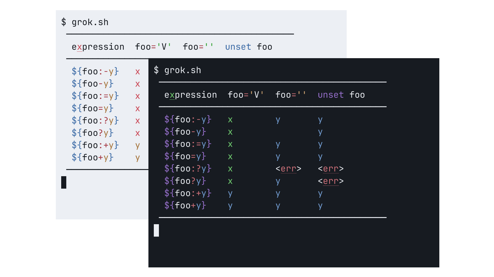

[][POSIX.1-2017]

# `grok.sh` - *The infamously hard to grok table!*

##### Original by [Mike Clark].

> _Now in **only ~~`957`~~ [`645 bytes`]**! The classic reborn! AT&T UNIX
> System V-friendly!_

Evaluates the _Parameter Substitution_ table in [POSIX.1-2017: Parameter
Expansion]:



###### Generated using [`agg`], [`asciinema`], [`Menlo`] typeface and `Github Dark` theme.

## Getting Started

### Prerequisites

- A [POSIX.1-2017] compliant shell, or any of the ones listed in [Supported
  shells](#supported-shells).

### Installation

Paste in a macOS Terminal or Linux shell prompt:
```sh
/bin/sh -c "$(curl -fsSL https://github.com/Neved4/colort.sh/tree/master/install.sh"
```

### Usage

```grok.sh [classic | modern | fusion]```

### Portability

#### Supported shells

|      Shell | Version       | Supported |
| ---------: | :------------ | :-------- |
|   [`bash`] | `5.2.15`      | Yes       |
|   [`dash`] | `0.5.12`      | Yes       |
|  [`ksh93`] | `93u+m/1.0.7` | Yes       |
|   [`mksh`] | `59c`         | Yes       |
|   [`oksh`] | `7.3`         | Yes       |
|    [`osh`] | `0.18.0`      | Yes       |
|   [`posh`] | `0.14.1`      | Yes       |
|   [`yash`] | `2.55`        | Yes       |
|    [`zsh`] | `5.9`         | Yes       |
| [`elvish`] | `0.19.2`      | No        |
|   [`etsh`] | `5.4.0`       | No        |
|   [`fish`] | `3.6.1`       | No        |
|   [`tcsh`] | `6.21.00`     | No        |
|    [`nsh`] | `0.4.2`       | No        |
|     [`nu`] | `0.85.05`     | No        |
|    [`ysh`] | `0.18.0`      | No        |
|  [`xonsh`] | `0.14.1`      | No        |

## Standards

This script conforms to [ISO 9945:2009][POSIX.1-2017], also known as
[POSIX.1-2017].[^1]

## License

`grok.sh` is licensed under the terms of the [MIT License].

See the [LICENSE](LICENSE) file for details.

[^1]: _IEEE Std 1003.1-2017: Standard for Information Technology — Portable
      Operating System Interface (POSIX®)_, ISO/IEC/IEEE 9945:2009/COR
      2:2017. URL: https://pubs.opengroup.org/onlinepubs/9699919799/

[`645 bytes`]: ./src/classic.sh
[`agg`]: https://github.com/asciinema/agg
[`asciinema`]: https://github.com/asciinema/asciinema
[`Menlo`]: https://en.wikipedia.org/wiki/Menlo_(typeface)
[`Github Dark`]: link
[`kanagawa.nvim`]: https://github.com/rebelot/kanagawa.nvim
[Mike Clark]: https://stackoverflow.com/a/67261832
[MIT License]: https://opensource.org/license/mit/
[POSIX.1-2017: Parameter Expansion]: https://pubs.opengroup.org/onlinepubs/9699919799/utilities/V3_chap02.html#tag_18_06_02
[POSIX.1-2017]: https://pubs.opengroup.org/onlinepubs/9699919799/

[`bash`]: https://git.savannah.gnu.org/cgit/bash.git/
[`dash`]: https://git.kernel.org/pub/scm/utils/dash/dash.git
[`ksh93`]: https://github.com/ksh93/ksh
[`mksh`]: https://github.com/MirBSD/mksh
[`osh`]: https://www.oilshell.org/cross-ref.html?tag=OSH#OSH
[`oksh`]: https://github.com/ibara/oksh
[`posh`]: https://salsa.debian.org/clint/posh
[`yash`]: https://github.com/magicant/yash
[`zsh`]: https://github.com/zsh-users/zsh
[`elvish`]: https://github.com/elves/elvish
[`etsh`]: https://etsh.nl/
[`fish`]: https://github.com/fish-shell/fish-shell
[`nsh`]: https://github.com/nuta/nsh
[`nu`]: https://github.com/nushell/nushell
[`tcsh`]: https://github.com/freebsd/freebsd-src/tree/main/bin/csh
[`ysh`]: https://www.oilshell.org/cross-ref.html?tag=YSH#YSH
[`xonsh`]: https://xon.sh/
